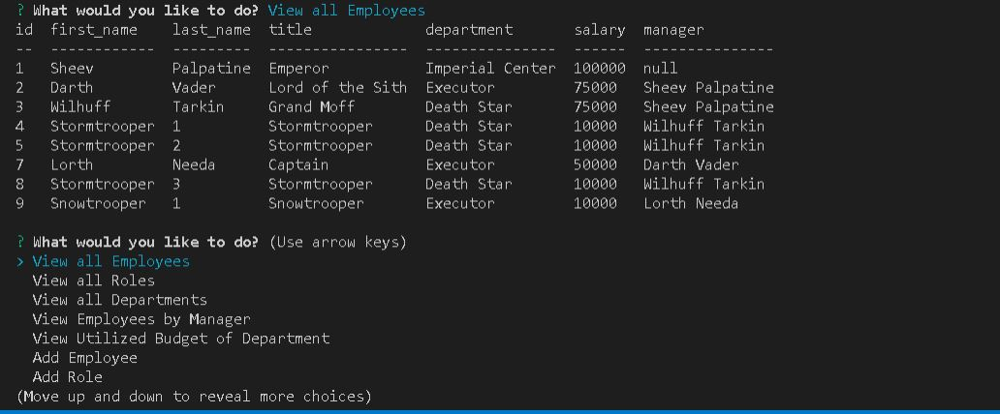

# employeetracker

## Project Title

employeetracker

## Project Link

- https://github.com/jamesrowe1/employeetracker
- https://www.youtube.com/watch?v=KdTZc_Jyl2Q

## Screenshot

## Getting Started

Begin by running npm install and updating the password in the employeeTrackerDBConnection.js file.

To run the application, type "node employeeTrackerDBConnection.js". You will be given many choices on how to impact the database you are working with, including but not limited to viewing employees, roles, and departments, adding employees, roles, and departments, and much more.

Simply select the option you wish to do, and follow and prompts given. Once you have completed using the application, simply select the "No more actions" choice to exit.

## Prerequisites

You must have node installed.

## Built With

- Visual Studio Code
- JavaScript
- Node
  - File system ("fs")
  - mysql
  - console.table
- Code hosted by Github
- Instructional Video Hosted by YouTube

## Authors

James Rowe

## License

Licensed under Awesome Coding L.L.C. (not a real company)

## Troubleshooting

For any issues contact James Rowe

## Acknowledgments

- Ben Wright
- Justin Pinero
- Wilson Linares
